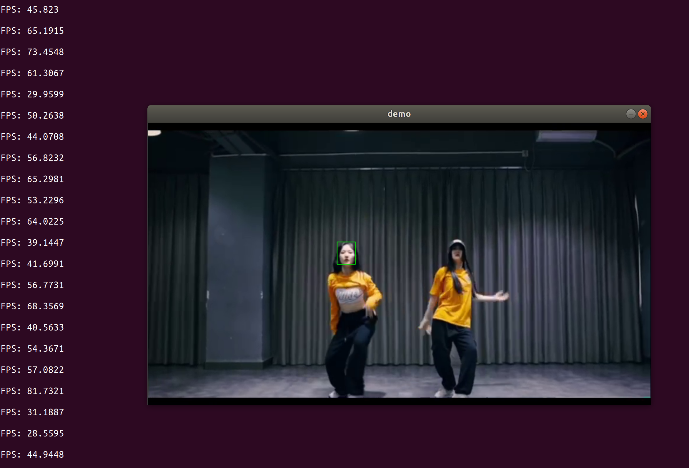

# NanoTrack 

libtorch版本部署的NanoTrack跟踪算法，纯C++编写

A Libtorch implementation of the NanoTrack algorithm, written with pure C++. 


## Demo
1. cmake
2. gcc 5.4 +


```
mkdir build && cd build
cmake ..

```

```
make

```

```
./NanoTrack_Libtorch

```

-效果图如下

